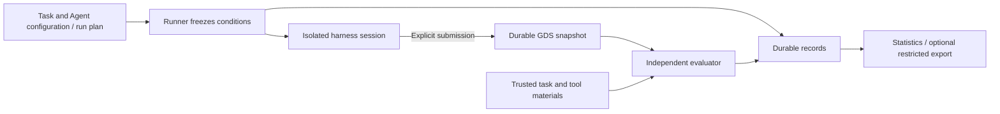

# Architecture and Extension Interfaces

Layout-Bench measures an Agent's ability to turn authoritative netlists, constraints, and process resources into GDS. The system under test includes the harness, model, prompt, context strategy, and tools; each measurement covers one task, one configuration, and one independent repetition. The benchmark owns a small session protocol and treats harness internals as opaque unless a run explicitly declares a managed or native runtime semantic. See the root [README](../README.md) for the current public scope.

<a id="repositories"></a>

The public repository owns the common framework, public tasks, reference solutions, and qualification materials. Private assembles hidden tasks, dedicated materials, authorization, evaluation plans, and deployment configuration; the dependency direction is **Private → Public**. Public installation and CI do not depend on the private repository. Credentials and continually growing raw run artifacts live outside the repositories.

<a id="architecture"></a>

## From Run to Report



| Responsibility | Code entry points | Contract / seam |
|---|---|---|
| Configuration and freezing | `tasks.py`, `model_config.py`, `provenance.py` | Validate inputs, configuration, files, and the actual execution identity; do not interpret the circuit |
| Run orchestration | `agent.py`, `swarm.py` | One execution and independent batch repetitions; invoke evaluation after stopping |
| Session and submission | `session.py`, `snapshot.py`, `submit.py` | Isolation, budgets, and the last valid submission; do not judge layout correctness |
| Harness and model gateway | `harnesses.py`, `session.py`, `inference.py` | Common session protocol, optional harness profiles, registered wire-family adapters, and host credentials; no EDA dependency |
| Evaluation | `evaluation.py`, `evaluate.py`, `toolchains.py` | Execute each task's dependency graph, call backends, and decide metrics |
| EDA and materials | `klayout.py`, `geometry.py`, `magic.py`, `ngspice.py`; `prepare.py`, `environment.py`, `prepare_support.py` | Tool execution, format interpretation, resource preparation, and validation |
| Evidence and statistics | `recording.py`, `recorder.py`, `report.py`, `admission.py` | Durable events and artifacts, evidence binding, statistics, and optional admission/export |

These modules live under `benchmarking/` and are assembled by the root `main.py`. A harness owns its provider conversation and tool orchestration unless it opts into a declared managed/native semantic; the runner enforces the external session contract and budgets, and the evaluator rejudges frozen candidates. Generated scripts, self-reported check results, and process logs cannot replace the final judge.

<a id="extension-layers"></a>

## Where to Change When Extending

- **New task**: add one unified circuit case with sources, inputs, constraints, and an evaluation plan, then complete [qualification](tasks.md#qualification). Models, budgets, and repetitions belong to the [run configuration](running.md), not to the case TOML.
- **New harness**: use `command` plus reviewed `files` and implement the `layout-session.v1` protocol. Add a profile under the harness seam only when launch preparation or a trusted capability declaration is reusable; the session runner must not learn the framework's internal conversation.
- **New model wire family**: register one adapter implementing `validate_request`, `prepare_request`, and `response_semantics`, then select it with the required `wire_api` field. The adapter owns HTTP method/auth/header conventions, terminal-state parsing, and mapping to the common nullable usage fields. Do not add one benchmark branch per model or per harness.
- **New EDA backend**: implement `identity` and `run(job, inputs) -> JobResult`, returning measured values with units, declared artifacts, and diagnostic evidence. The backend owns execution isolation and format interpretation and may use a container, a native library, or a controlled remote tool.
- **New process or environment**: configure support bundles, device mappings, rules, and parameters, then validate the supported range using the [tools guide](tools.md). Individual tools being usable does not mean their combination has passed task qualification.

`evaluation.py` and `evaluate.py` do not import concrete tools; `tasks.py` depends only on evaluation data definitions. `toolchains.py` assembles backends at the entry point: `backends.<id>` declares `type` and `settings`, while `bindings` maps logical operations to backend IDs. Python callers may also inject a backend instance or factory. Task files cannot trigger dynamic Python imports; decks and file formats for different EDAs must be adapted explicitly.

A unified image serves preparation, solving, and judging, while each role runs in its own container. The session runner controls mounts, the optional model gateway, budgets, and trusted materials; the evaluator never sees Agent credentials or a writable workspace. A public development host may be controlled by the user; confidentiality for hidden data depends on a host controlled by the evaluator and cannot be provided by containers on the user's machine. See [admission and export](admission.md) for optional mechanisms and trust seams.

<a id="harness-semantics"></a>

## Harness and Runtime Semantics

The external seam is the same for every harness:

```text
task inputs + /protocol/harness.json
              ↓
        executable harness
              ├─ python -I /protocol/process_check.py (optional)
              ↓  python -I /protocol/submit.py
       frozen candidate snapshot
              ↓
       independent evaluator
```

Every run records a `HarnessSpec` with `id`, `version`, `protocol`, `mode`,
capabilities, and optional `wire_api`. The default `external-cli` profile is
`opaque`: the benchmark does not inspect or reproduce the harness's internal
conversation. `managed` and `native` are explicit measurement conditions and
must be kept separate in reports when context ownership changes. The harness
runtime remains outside the benchmark core and is not part of task or judge
semantics.

The optional `process-feedback.v1` capability adds a read-only
`python -I /protocol/process_check.py` request. The host snapshots the current
output, evaluates that immutable snapshot with the same evaluation plan and
backend identities used by the final judge, and returns a diagnostic summary.
Each request and result records the candidate digest, tool identity, elapsed
time, report artifact, and any error in the durable event journal. Feedback
never becomes a submission and never changes the independent final evaluation;
`run.json.process_feedback` is reported separately. A harness without the
capability does not receive the helper or feedback instructions.

The public examples include a provider-neutral `managed` reference harness.
Its fixed loop owns the prompt, conversation history, bounded `run_command`
tool, and explicit `submit_layout` tool. A separate adapter process converts a
provider or local model into the normalized JSONL request/response contract;
the loop does not import a vendor SDK or choose a model. Use the same harness,
tool definitions, prompt, and budgets when comparing adapters, and record the
adapter command and version as part of the Agent configuration. The included
deterministic adapter is a protocol control only, not a model baseline.

The host-owned gateway is provider-neutral: a frozen `wire_api` selects one
trusted registry adapter, while credentials, the fixed endpoint, request and
response limits, socket framing, budgets, and durable evidence remain in the
gateway. `responses` is one optional built-in wire family, not a benchmark
assumption. A harness may provide its own bridge to the socket, but the bridge
must keep the same declared wire family. Supporting another provider API means
registering one adapter and its semantic tests, not changing the session
runner or adding a branch for every Agent framework.

The adapter seam is deliberately small:

| Adapter method | Responsibility | Must not do |
|---|---|---|
| `validate_request(path, body, model) -> bytes` | Validate and canonicalize one client request for the frozen model and wire paths | Select a destination, read credentials, or spend a request budget |
| `prepare_request(path, body, model, credential) -> WireRequest` | Choose the relative HTTP path, method, and authentication/header convention | Return an absolute URL or bypass the fixed profile endpoint |
| `response_semantics(path, content_type, body) -> {outcome, reason, usage}` | Validate a terminal response and map usage to `input_tokens`, `output_tokens`, `cached_input_tokens`, `reasoning_output_tokens`, and `cost` (missing values stay `null`) | Mark a malformed or failed response as a model/layout failure |

Adapters are trusted framework code registered by the host; task files and
harnesses cannot load arbitrary Python. The canonical harness remains a
separate normalized JSONL conversation/tool seam and does not import a wire
adapter or vendor SDK.

## Design Basis

The references below explain design choices; they are not execution rules or runtime dependencies for this project:

| Pinned source | What is borrowed and where it stops |
|---|---|
| [ARC-AGI-3 Benchmarking](https://github.com/arcprize/arc-agi-3-benchmarking/tree/1aa78da7e3058e0ead572ede7cd97065d1e5befc) | Adapters, exit reasons, and structured step-by-step records are useful; game actions, human baselines, and the scoring formula do not apply to layout. Its hidden-task access and official scoring depend on an external platform, so the local harness is not a complete hosted-service specification. |
| [SWE-bench harness](https://github.com/SWE-bench/SWE-bench/blob/02e7a74ffd0b707aab73d203fe87bdc7c76afc8e/docs/reference/harness.md) | Independent environments, execution limits, and machine-readable evidence are useful; caches still need to bind this project's candidate and judge inputs. |
| [VerilogEval](https://github.com/NVlabs/verilog-eval/blob/c498220d0a52248f8e3fdffe279075215bde2da6/README.md) | Fixed tools, sampling parameters, and result identity are useful; successful RTL simulation does not imply task success for layout. |

Use [tasks and evaluation](tasks.md) for actual decisions and the [running guide](running.md#scoring) for statistics. DRC/LVS are physical-validity gates; a complete task must also meet its declared geometry and post-layout requirements.
